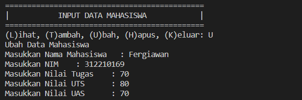
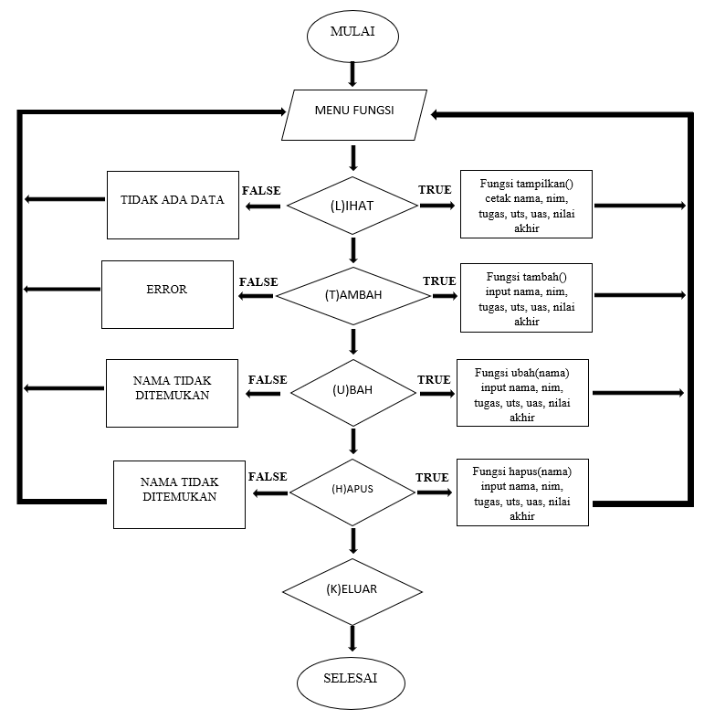

# Praktikum7
## Fergiawan Satrio Bagaskoro
### Latihan 1
Di latihan 1 ini kita akan mengubah data menjadi bentuk lambda. disini ada beberapa data yang akan kita rubah
```
def a(x):
return x**2

def b(x, y):
return math.sqrt(x**2 + y**2)

def c(*args):
return sum(args)/len(args)

def d(s):
return "".join(set(s))
```

Diatas adalah bentuk data yang akan kita rubah menjadi bentuk lambda menjadi seperti dibawah

```
def a(x):
  return x**2
a = lambda x : x**2
print(a(200))
def b(x, y):
  return math.sqrt(x**2 + y**2)
b = lambda x, y : x ** 2 + y ** 2
print(b(100, 200))
def c(*args):
  return sum(args)/len(args)
c = lambda *args : sum(args)/len(args)
print(c(500, 600, 700, 800))
def d(s):
  return "".join(set(s))
d = lambda s: "".join(set(s))
print(d("Fergiawan"))
```

Dan hasil output menjadi seperti ini


### Tugas Praktikum
Di tugas praktikum kita akan membuat program yang akan menampilkan list nilai mahasiswa dengan penggunaan fungsi seperti
fungsi tambah(), fungsi tampilkan(), hapus(nama), dan ubah(nama).

**Source Code**

```
a = {}

def tambah():
    print("Tambah Data Mahasiswa")
    nama = input("Masukkan Nama Mahasiswa\t: ")
    nim = input("Masukkan NIM            : ")
    tugas = int(input("Masukkan Nilai Tugas\t: "))
    uts = int(input("Masukkan Nilai UTS\t: "))
    uas = int(input("Masukkan Nilai UAS\t: "))
    akhir=(int(tugas)*30/100)+(int(uts)*35/100)+(int(uas)*35/100)
    a[nama] = nim , tugas, uts , uas , akhir
def tampilkan():
    if a.items():
        print("")
        print(81*"=")
        print("| {0:^77} |".format("LIST NILAI MAHASISWA"))
        print(81*"=")
        print("| No |      Nama      |     NIM     |  Tugas  |   UTS   |   UAS   |    Akhir    |")
        print(81*"=")
        i = 0
        for b in a.items():
             i += 1
             print("| {no:2d} | {0:14s} | {1:11s} | {2:7d} | {3:7d} | {4:7d} | {5:7f}   |"
                . format ( b [ 0 ][: 14 ], b [ 1 ][ 0 ], b [ 1 ][ 1 ], b [ 1 ][ 2 ], b [ 1 ][ 3 ], b [ 1 ][ 4 ] , no = i ))
        print(81*"=")
    else :
        print("")
        print(81*"=")
        print("| {0:^77} |".format("LIST NILAI MAHASISWA"))
        print(81*"=")
        print("| No |      Nama      |     NIM     |  Tugas  |   UTS   |   UAS   |    Akhir    |")
        print(81*"=")
        print("| {0:^77} |".format("TIDAK ADA DATA"))
        print(81*"=")
def hapus():
    print ( "Hapus Data Mahasiswa" )
    nama = input("Masukkan Nama Mahasiswa   : ")
    if  nama in a.keys ():
        del  a[ nama ]
    else :
        print ( "Nama {0} Tidak Ditemukan" . format ( nama ))
def ubah():
    print ( "Ubah Data Mahasiswa" )
    nama = input("Masukkan Nama Mahasiswa\t: ")
    if nama in a.keys ():
        nim = input("Masukkan NIM            : ")
        tugas = int(input("Masukkan Nilai Tugas\t: "))
        uts = int(input("Masukkan Nilai UTS\t: "))
        uas = int(input("Masukkan Nilai UAS\t: "))
        akhir=(int(tugas)*30/100)+(int(uts)*35/100)+(int(uas)*35/100)
        a[nama] = nim , tugas, uts , uas , akhir
    else :
        print ( "Nama {0} Tidak Ditemukan" . format(nama ))

while True:
    print("")
    print(45*"=")
    print("| {0:^41} |".format("INPUT DATA MAHASISWA"))
    print(45* "=")
    c = input("(L)ihat, (T)ambah, (U)bah, (H)apus, (K)eluar: ")
    if c.lower() == "l":
        tampilkan()
    elif c.lower() == "t":
        tambah()
    elif c.lower() == "u":
        ubah()
    elif c.lower() == "h":
        hapus()
    elif c.lower() == "k":
        print()
        print(45*"=")
        print("| {0:^41} |".format("TERIMA KASIH"))
        print(45*"=")
        break

```

Jika kita ingin menginput data maka kita ketik "T" untuk menambahkan data mahasiswa


Dan jika kita ingin melihat data yang telah kita input maka kita ketik "L"


Jika kita belum menginput data dan kita mengetik "L" maka tampilannya akan seperti ini


Kita juga bisa mengubah data yang telah kita input dengan mengetik "U"




Setelah selesai menginput data maka ketik "K" untuk mengakhiri program


### Flowchart


**Deskripsi**
1. Saat run program akan menampilkan tampilan pilihan fungsi
2. Pilih fungsi mana yang diinginkan
3. Jika memilih fungsi (L)ihat maka output akan menampilkan tidak ada data karena belum menginput data atau menampilkan
    data mahasiswa jika sudah menginput data mahasiswa
3. Jika memilih fungsi (T)AMBAH DATA maka input data mahasiswa
4. Jika memilih fungsi (U)BAH DATA maka akan menginput nama dari data yang ingin di ubah, lalu masukan nim, tugas, uts,uas
5. Jika memilih fungsi (H)APUS DATA maka input nama data yang ingin di hapus
7. Jika memilih fungsi (K)eluar maka program akan berhenti (BREAK)
8. Selesai


